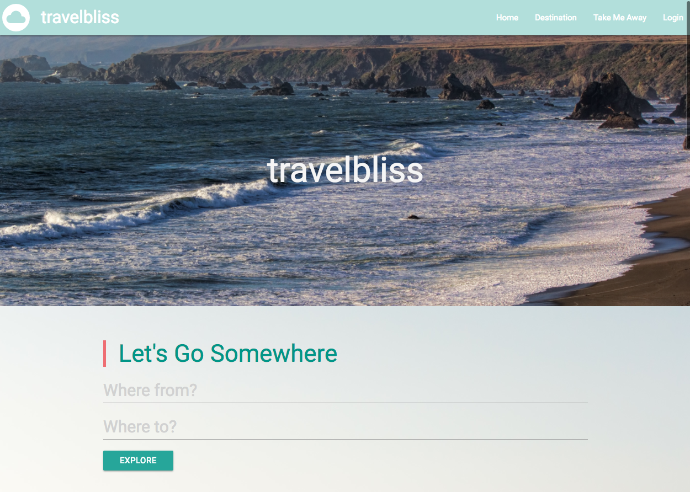

# travel-repo

# travelbliss

Travelbliss makes it easy to plan your next adventure.  Find the cheapest airline ticket available to your destination this year.  Compare modes of transportation to see what works best for you.  You can even read articles, watch travel blogs, check the local weather, and view restaurant options!  When you’re ready to go, Travelbliss will create a custom playlist based on your journey.

## Screenshots
I

## Technologies used

- HTML
- CSS
- Javascript
- jQuery
- Firebase
- Materialize CSS
- Rome2Rio API
- Wikipedia API
- YouTube API
- Google Maps API
- Yelp API
- Weather API
- New York Times API
- Spotify API
- SkyScanner API
- Pixabay
- Trello
- moment.js

## Built With

* Sublime Text
* Pen and Paper

## Authors

* **Jessica Hornsten** - *Initial work* - [hornsten](https://github.com/hornsten)
* **Mitali Naik** - *Initial work* - [mitalimn](https://github.com/mitalimn)
* **Uyen Lam** - *Initial work* - [uyenlam](https://github.com/uyenlam)

See also the list of [contributors](https://github.com/hornsten/travel-repo/graphs/contributors) who participated in this project.

## License

This project is licensed under the MIT License - see the [LICENSE.md](LICENSE.md) file for details

## Acknowledgments

* facet.com
* trover.com